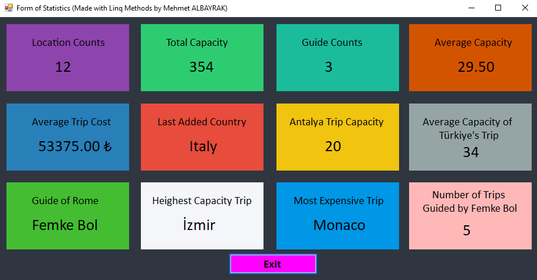

# README for --> DBFirst.EFProject

This project is a **Windows Forms** application developed using **Entity Framework** to dynamically retrieve and display travel-related statistics from a database.

## Overview

The application utilizes **Entity Framework LINQ methods** to query and analyze data. Key LINQ methods used include:

- **`Count`**: Retrieves the total number of records (e.g., total locations or guides).
- **`Sum`**: Calculates the total values for numeric fields (e.g., total capacity).
- **`Average`**: Computes the average values (e.g., average trip cost or capacity).
- **`Max`**: Identifies the highest values (e.g., maximum capacity or most expensive trip).
- **`Where`**: Filters records based on specific conditions (e.g., trips in a specific city or country).
- **`Select`**: Projects specific fields (e.g., guide names or trip destinations).
- **`FirstOrDefault`**: Retrieves the first matching record or a default value if none exist.

## Project Overview

These methods are combined to efficiently calculate and present various statistics, such as:

## Technologies Used

- **C#:** For developing the Windows Forms application.
- **Entity Framework:** For database querying and manipulation.
- **MSSQL:** As the database backend.
- **.NET Framework:** As the runtime environment.
